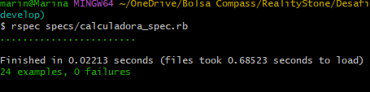
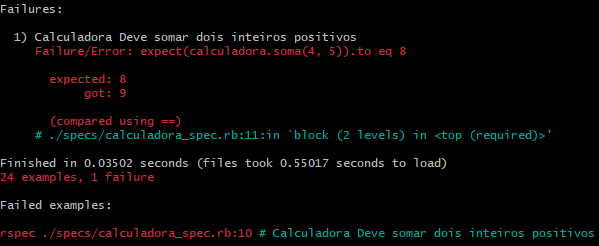
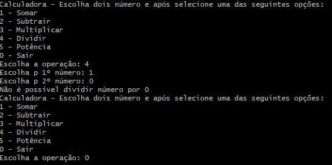

 

  

###

###

<h2 align="center">Challenge PB- Sprint 4</h2>

###

<h1 align="center">Sprint 4</h1>

###

Esta sprint abordou diversos assuntos, e nesta plataforma do github, estes aprendizados e desafios foram colocados de maneira organizada em pastas e arquivos para um melhor entendimento. Os temas abordados foram:  ** Git,  **Github,  **Linguagem de programação Ruby,  **Testes unitários do Ruby Koans (para fazer os testes passarem. Para executar um arquivo específico: `ruby about_asserts.rb`),  **Framework RSpec,  **Desafio da calculadora. 

###

<h1 align="center">Sobre o projeto</h1>

###

O desafio consiste em uma calculadora implementada em Ruby, seguindo a abordagem do Desenvolvimento Orientado por Testes (TDD). Isto é, primeiramente testes unitários foram levantados para validar a funcionalidade das operações da calculadora, e após foi implementado a funcionalidade da calculadora. 

## Funcionalidades

A calculadora desenvolvida realiza as seguintes operações(Métodos):

- **Adição:** 
- **Subtração:** 
- **Divisão:** 
- **Multiplicação:** 
- **Potenciação:** 

###

<h3 align="left"> Pré-requisitos para a calculadora</h3>

###

Para este projeto é preciso configurar um ambiente de desenvolvimento e ter conhecimento destas tecnologias. Para as instalações dos links abaixo, sempre deve ter cuidado para selecionar as versões compativeis com o sistema operacional. 

1. **Instalar o Ruby:** Baixe e instale o Ruby. Intalação através do link: https://rubyinstaller.org/downloads/.

2. **Instalar o Visual Studio Code:** Intalação através do link: https://code.visualstudio.com/

3. **Baixar o git:** https://git-scm.com/downloads

4. **Criar conta no Github:** https://github.com/

5. **Adicionar Pluguins:** Ruby, Ruby Solargraph

6. **Adicionar dependência do RSpec:** Esta gem possibilita criar cenários e verificar as validações em cima do código, neste caso foi usado em nível de unidade mas ele também é usado em cenários mais amplos.    http://rubygems.org  
                                 No terminal: `bundle install rspec`         

7. **Criar a estrutura do projeto:** Armazenar os códigos da calculadora, com os devidos testes, nos arquivos dentro das pastas. 

## Execução dos testes  

 Na pasta onde o projeto foi criado abrir o gitBash e em seguida digitar o código:  `rspec specs/calculadora_spec.rb`

- **Quando está tudo certo:**  
  

- **Quando algum teste apresenta falhas:**   
  

###

## Realizando interação da calculadora com usuário 

Digita neste mesmo terminal da execução   `ruby app/app_calculadora.rb`
   

###

## Deploy - Realizar Pull Request

Quer alterar este projeto? 

- **Criar uma nova branch:** - No terminal:  `git checkout -b nova_branch` 
- **Altere o código faça os commits:** - No terminal: `git commit -m "mensagem_do_commit"`
- **Envie a branch para o GitHub:** Envie a branch - No terminal: `git push origin nova_branch`
- **Crie um Pull Request:** No GitHub, na página do repositório do usuário no botão: "Compare & pull request". E em seguida o botão: "Create Pull Request".
###

## Autora

- **Marina Chaves Webber:**  - https://github.com/marinacwebber/RealityStone_-marina_webber-_Compass/blob/main/README.md

###
## Créditos
- **Agradeço a compass pela oportunidade, ao Scrum Master "Rafael Vescio" por nos apoiar e também agradeço ao time, que está sempre pronto para ajudar!**
- **Site pesquisado:** - https://www.tutorialspoint.com/ruby/ruby_operators.htm

###
## Licença

Este projeto está licenciado sob a [Licença MIT](/LICENCE). 
###